# 引言
## 定点数如何表示
1.	原码
    1. 表示方法：是最简单的机器数表示法，用最高位表示符号位，其他位存放该数的二进制的绝对值。其中最高位1表示负，0表示正。例如：0010表示2，1101表示-5
	2. 特点：
        -	表示方法很直观，简单易懂
        -	有+0，-0两种情况
        -	加减法运算需要先进行绝对值运算，再根据符号位确定最终结果，硬件设计上较难。
2.	反码
	1. 表示方法：正数的反码还是等于原码；负数的反码就是它的原码除符号位外，按位取反。例如： 1101表示-2
	2. 特点：
       -	反码通常作为原码->补码的过渡阶段，实际意义不大
3.	补码
	1. 表示方法：正数的补码等于它的原码；负数的补码等于反码+1（计算方法）
	2. 目的及原理：为了实现加减法的直接计算。由于计算机字长的限制，一定位数的变量只能表示一定范围的值，因此当计算结果超出这个范围的时候会默认进行“取模”操作。而在这种运算中，减[X]相当于加[X]的补数。例如：位长为3位，则相当于结果取8（2的3次方）的余数。则 a-010 可以看成是 a+110（因为010+110=000）
	3. 特点
        -	只有一个0
        -	实现加减法的直接运算
        -	计算机均采用补码进行运算
4.	移码
    1. 表示方法：补码的符号位取反
	2. 特点：将对应无符号整数一一对应地进行了平移，建立新的映射关系。

# 加减法
加法和减法是两种基本的算术运算，用计算机进行的二进制加减法运算与我们平时用纸笔进行的加减法运算肯定是不一样的，那它是如何实现的呢，下面让我们一起来分析一下。
## 二进制加法
举个简单的例子：
用二进制表示形式计算610加710，计算过程如下：

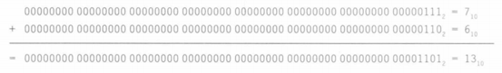

在整个加法计算过程中，只有右边的4位发生了变化，下图表示求和与进位，箭头表示进位是如何传递的：

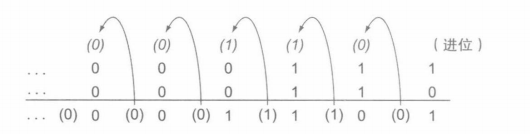

和我们平时用纸笔进行计算的过程相似，对于被加数和加数，我们从右到左依次进行两个1-bit二进制数相加，并将进位参与到运算中，最后还可能产生进位的输出。
最右边一位将0和1相加，该位的结果为1，且进位为0。因此，右边第二位的操作是0+1+1，求和产生结果0与进位1。第三位的操作是1+1+1，求和结果为1，且进位为1。第四位操作是1+0+0，求和结果为1，且进位为0。

## 二进制减法
现在，我们已经知道了二进制的加法运算过程，那减法呢？

很容易想到，减法和加法是相对的运算，那么与加法操作相似，只是***从右到左依次进行两个1-bit二进制数相减，并将借位参与到运算中去，减法不就完成了？***

还是上面那个例子，这次我们试着进行减法的运算：

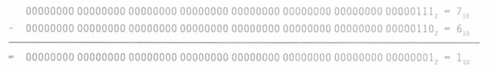

最右边一位将1和0相减，结果为1，借位为0。因此，右边第二位的操作是1-1-0，产生结果0与借位0。第三位的操作是1-1-0，结果为0，且借位为0。到这里，我们的减法操作就已经完成了。

最终我们得出减法的结果为1。

但是，思考一下，除了直接将两个数相减，还有没有别的策略？

相信有的同学心中已经有了答案：将相应的操作数进行简单的取反后再进行加法操作不也可以吗。
的确，我们可以将减数取反，与被减数进行加法操作。

在上面的例子中，我们可以使用-6的二进制补码来进行加法计算：
 
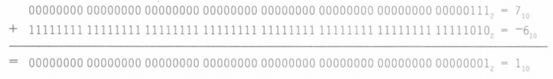

至此，我们的加法和减法的运算过程已经分析完毕，接下来就要将其在硬件上实现相应的功能，但是在此之前，我们需要思考一下，我们目前的方案足够完善吗？
## 溢出
1. 有符号溢出
   - 回想一下，硬件规模总是有一定限制的，比如字宽为64位，当运算结果超过这个限制时，就会发生溢出。那么我们该如何解决溢出问题呢？要想解决溢出，首要的任务显然是检测溢出的发生。我们先思考一下，什么时候一定不会发生溢出呢？
     1. 加法中一定不会发生溢出的情况。当不同符号的操作数相加时，不会发生溢出，因为总和一定不会大于其中任意一个操作数。例如，-10+4=-6。由于操作数可以表示成64位且其总和不大于任一操作数，所以总和也一定能表示成64位。因此，当正负操作数相加时不会发生溢出。
     2. 减法中一定不会发生溢出的情况。与加法相似，但原理相反：当操作数符号相同时，不会发生溢出。有了上面对加法的分析，这点就很容易理解了，因为我们通过将第二个操作数取反，然后相加来实现减法。因此，当相同符号的操作数相减时，最终会变成相反符号的操作数相加，一定不会发生溢出。
     3. 有符号溢出情况。我们已经知道了加减法不会溢出的情况，那么什么时候会发生溢出呢？显然，当两个64位的数字相加或相减后产生一个需要65位才能表示的结果时，发生了溢出。即符号位被结果的值占用而非结果的正确符号。这下就豁然开朗了：当两个正数相加但和为负数，或者两个负数相加但和为正数时，加法运算发生了溢出；当正数减负数得到负数结果，或者负数减正数得到正数结果时，减法运算发生了溢出。这种荒谬的结果意味着产生了从符号位的进位或借位。下表展示了溢出发生时的运算、操作数和结果的各种组合情况：

        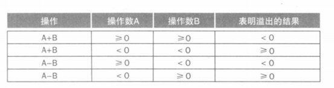
     4. 无符号溢出。无符号整数通常用于表示忽略溢出的内存地址。幸运的是，编译器可以轻松检查出使用分支指令的无符号溢出：如果总和小于加数中的任何一个，则加法溢出，而如果差大于被减数，则减法溢出。
## 硬件实现
1. 半加器。功能：将两个一位二进制数相加输入端口A、B输出端口S（和）、C（进位）由一个异或门和一个与门组成
   
   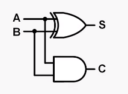
2. 全加器。由两个半加器构成输入端口A、B、Cin（进位输入）输出端口S（和）、Cout（进位输出）

    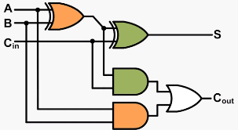
3. 4bit加法器。我们将四个全加器串联起来，前一个全加器的进位输出作为后一个全加器的进位输入，即可实现4-bit加法器：实现了4-bit的加法器，我们就能以此为例，进一步增加串联全加器的数量，从而实现更多位数的加法器。

    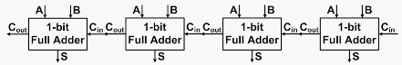

# 乘法
## 乘法是怎样计算的
由此引出乘法器的实现逻辑，以十进制下1000*1001为例，具体描述乘法运算过程：从左到右选择乘数数中的一位，用这一位乘上被乘数，然后将得到的中间结果相对于前一位的结果左移一位，将得到乘数位数个结果相加得到积。
## 设计考虑
如何储存乘数与被乘数，中间及最后结果，所需寄存器的大小？
储存积寄存器位数=被乘数寄存器位数+乘数寄存器位数
## 计算中间值
1. 当乘数为1时，将被乘数复制到合适位置。
2. 当乘数为0时，将0放到合适位置。

整体的构建是怎样的？由哪几部分组成？
组成：

1. 存储被乘数，乘数，结果的寄存器
2. 计算单元
3. 控制测试单元
## 逻辑图
对每一个乘法选择乘数数中的一位，用这一位乘上被乘数等的循环实现如下：

1. 获取乘数第0位，判断乘数第0位为0或1，为0时这一循环中间结果加上0，为1时中间结果加上被乘数
2. 将被乘数左移一位
3. 将乘数右移一位
4. 判断是否重复循环，risc-V中乘数为64位，进行64次循环
   
是否一定进行64次循环？
耗费资源将乘数寄存器的每一位作逻辑合判断，如为0则说明此时乘数为0，不用继续循环
## 乘法器实现器件图
64位乘64位，积寄存器需要128位。

1. 从乘数寄存器获取乘数第0位，判断乘数第0位为0或1，为0时这一循环中间结果加上0，为1时中间结果加上被乘数，为达到目的将信息传给控制测试块，控制测试块控制alu的计算和对结果积寄存器的写入。
2. 控制测试块控制将被乘数寄存器数据左移一位
3. 控制测试块控制将乘数寄存器数据右移一位
## 乘法器的改进
1. 空间占用上的优化
    1. 使用更小的寄存器(压缩位宽)
    2. 复用寄存器
2. 时间消耗上的优化
    1. 像加法器的优化一样，使用更多计算单元，空间换时间
    2. 一个时钟周期计算多位
## 空间优化
每次循环乘数寄存器数据右移一位且乘积最开始为0逐渐增大每次循环多一位-->复用寄存器
乘积最开始为0逐渐增大每次循环多一位则每次将中间结果左移，不用左移被乘数-》被乘数，alu位宽被压缩
同时复用寄存器且压缩位宽
## 时间优化
1. 使用更多计算单元，第一个周期计算每一位乘数与乘积得到的结果，往后每一个时钟周期将它们的结果两两相加计算并考虑进位的问题，这样64位乘法需要log2（64）次，即6次64位长加法的时间做完。
2. 一个时钟周期计算多位（两位为例）
   
注意控制信号

- 当乘数位为00时，中间结果为0
- 当乘数位为01时，中间结果为乘数
- 当乘数位为10时，中间结果为乘数左移一位
- 当乘数位为11时，中间结果为乘数左移一位加上乘数
  
有符号乘法，将被乘数乘数的低63位相乘符号位单独处理，进行同或运算为其结果符号位

##	Rsci-V乘法指令
Mul x5,x6,x7 将x6和x7的乘积结果的低64位放入x5寄存器

Mulh x5,x6,x7将x6和x7的乘积结果的高64位放入x5寄存器

Mulhu则是无符号数的乘指令，将x6和x7的乘积结果的高64位放入x5寄存器

Mulhsu x5,x6,x7

Risc-V中与x86不同的一个有符号数，一个无符号数相乘操作，x6当作有符号数，x7当作无符号数，将x6和x7的乘积结果的高64位放入x5寄存器

# 除法
## 回顾MIPS除法器设计
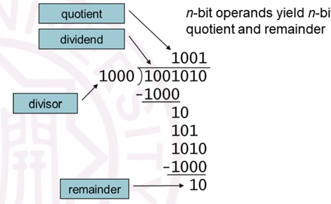

要解决：
1. 除数为0怎么办
2. 如何判断到达最后一步
3. 针对除法操作后不够除如何“回退”(恢复)被除数的值

导出设计图

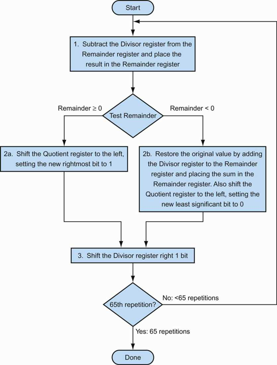

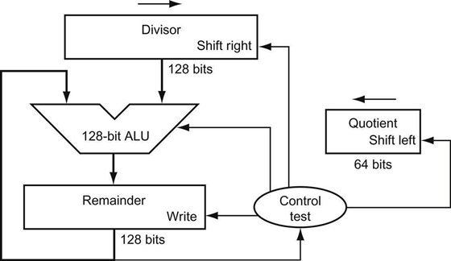

在此基础上，我们探讨了如何从空间和时间角度来优化除法器。
在空间角度上，我们注意到除数有一半是没有被使用的，余数也是有一半是无用的，我们提出的解决思路是寄存器复用
而在时间角度上，我们说明了基于这种实现原理的除法器是没有办法做到像乘法器一样的并行处理的，这是因为每两个之间的指令是有依赖关系的。

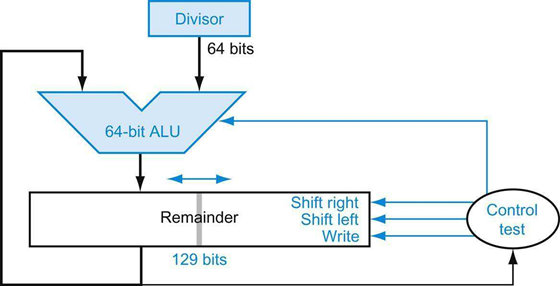

优化的方案：
1.	除数寄存器缩小为64位，无需支持移位；
2.	取消商寄存器
3.	128位的ALU缩减为64位的ALU
4.	余数寄存器只有高64位参与加减法运算
5.	余数寄存器需支持左移和右移操作
6.	商从右端逐位移入余数寄存器
7.	运算结束后，商占据余数寄存器的低64位

原先的结构：
1.	一个128位的余数寄存器
2.	一个128位的除数寄存器
3.	一个64位的商寄存器
4.	一个128位的ALU（加法和减法）

现在的结构：
1.	一个129位的余数商寄存器
2.	一个64位的除数寄存器
3.	一个64位的ALU

可以发现，相比于原先的结构，现在的结构空间大大减小，129位的余数商寄存器可以分为如下几个部分：

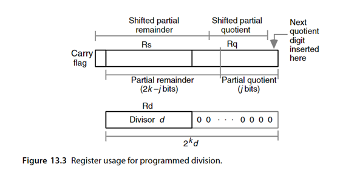

- 问题：为什么除数不需要移位操作了？ 
- 问题：这种除法器是如何工作的？为什么能将余数和商拼接在一起？
- 问题：ALU为什么只需要64位？
- 问题：为什么需要一位进位？

在之前的实现当中，我们是基于除数的移位操作来实现的，但是实际上更加自然的实现方式是被除数进行移位来进行运算，下面我们来详细介绍一下基于这种除法器的除法器的运算过程：这里以(1101)2除以(0010)2为例：

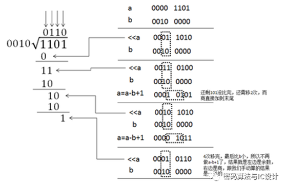

针对上述运算中，我们发现只需要进行64位的算术逻辑运算就可以计算出最后的值，至于进位实际上是为ALU中的加法提供的。
问题：上面介绍的都是无符号数的除法计算，那么有符号数如何计算呢？
实际上，对于有符号数我们只需要记住被除数和除数的符号然后进行类似无符号数的除法运算就行了。

## RISC-V除法指令
不同于MIPS用同一条指令来计算商和余数，RISC-V是将余数和商用两条指令分别表示的：用div和divu计算商，用rem和remu计算余数的。
DIV 和 DIVU 指令分别执行有符号、无符号的 XLEN 位整数除以 XLEN 位整数除法操作。REM、REMU 给出了相应除法的余数。如果同时需要商和余数，建议的代码顺序为：DIV[U] rdq,rs1,rs2; REM[U] rdr,rs1,rs2（rdq 不能是 rs1 或者 rs2）。

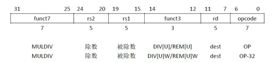

对于溢出和0的检测仍然需要编译器来判断，编译器是如何判断的呢？

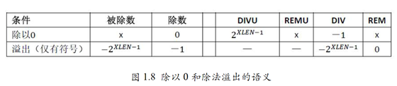

实际上编译器通过商和余数的值来判断是否溢出或者除以0.
## 再往远处走点
除法器没有办法实现像乘法器一样的并行化，从根本上说是除法器制作原理的问题，那么有没有可能换种思路实现除法器的并行化呢？恢复余数除法器（Restoring Hardware Dividers）