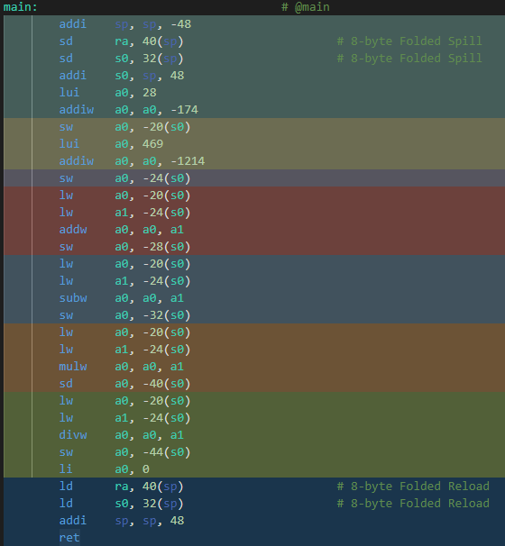

# 计算机组成习题
- ## 溢出
  小明是一名开带计算机专业的大学生，平时作业只想摸鱼，但幸好他有一个像你这样热心帮助他的舍友.在周末写作业时，老师布置的一道判断溢出的题给他整不会了，没有办法的他只好像你求助.这道题是这样的，证明下面程序可以正确判断补码乘法溢出.作为小明的好舍友，你当然愿意帮助他了，不是吗？
    ``` c++
    int is_safe(int x,int y){
        int p = x*y;
        return !x || p/x == y;
    }
    ```
- ## 运算相关的汇编代码阅读
  小明正在深入学习c++，c++是一种编译型语言，需要通过预处理，编译，汇编，链接四部才能生成可执行代码.小明想通过命令行的方式完整来一遍程序生成的流程.可是在进行完`gcc -S hello_riscv.i -o hello_riscv.s`后，小明不小心删除了`hello.c`和`hello.i`!好在他还记得代码大致的模样，但有些地方实在是想不起来了.但小明突然意识到可以通过`hello.s`对应部分的代码得到原先的代码.但小明是个不好好学习的大学生,不知道`objdump`，计组汇编代码部分也没有好好学，小明只好找你求助了，你能帮帮小明还原代码吗？(注:对应汇编代码为`risc-v`)
    ``` c++
    int main(){
      int a=_______;
      int b=_______;
      int c=_______;
      int d=_______;
      long long e=_;
      int f=_______;
    }
    ```

    
- ## 了解超前进位加法器，分步超前加法器和串行加法器
  上完一下午的计算机组成课后，饿肚子的小明在原之味猛火炒饭窗口前排队，看着厨房里忙碌的师傅和前面长长的队伍，他突然想到如果炒饭的时候做饭师傅提前知道每个顾客点的炒饭，就可以把相同的菜一起炒，大大加快菜的出锅速度.小明突然意识到这和刚刚学的先行进位加法器很像，提前知道每个位的数字经过特殊的电路搭建就可以并行的得到算数结果，运算速度将是串行加法器的好几倍.这引起了小明的思考，如果一个2输入门的延迟是`150ps`，那么下面的加法器延迟会是多少呢?
  1. 行波进位加法器
  2. 4个单元为一组的先行进位加法器
   
  
   
  在餐桌上小明和你说了下他刚刚想到的问题.你觉得挺有意思的，于是你边吃杨国福麻辣烫边思考小明的问题.
- ## 除法器原理，填写第几步时执行的值
  小明上课的时候对除法器的过程不是很熟练，于是自己尝试用硬件描述计算1919810除以114514。当计算完后他在大叫"太棒了，我逐渐理解了一切!".你凑到小明旁边想看看他又在整什么活，结果你看到他的运算过程笑了一下，请你解释一下为什么你会发笑.
- ## 饱和运算
  小明又找你问问题，你有点不耐烦了，但小明说一会帮你带饭，你又愉快地答应了.大致扫了下题目发现是比较陌生的饱和运算.题目是这样的，计算补码加法，但是正溢出时返回补码最大表示值，负溢出返回补码最小表示值，没有溢出返回正常结果.但是这个题只允许使用最基础的加减和位运算.小明看不懂答案的代码，想让你帮他解释一下为什么答案的代码.为了让小明带饭你当然会帮他的，不是吗？
    ``` c++
    int saturating_add(int x, int y)
    {
        int result = x + y;
        int bias = (sizeof(int) << 3) - 1;
        int condition1 = ~(x >> bias ^ y >> bias);
        int result_signed = result >> bias;
        int condition2 = result_signed ^ (x >> bias);
        int condition3 = condition1 & condition2;
        int result_overflow = result_signed - (0x1 << bias);
        return (result_overflow & condition3) | (result & ~condition3);
    }
    ```

# 实验-Baugh-Wooley乘法器
## 背景及原理
Baugh-Wooley算法是由Baugh和Wooley于1973年提出的二进制补码并行阵列相乘算法。该算法转化为等效并行阵列相加，其中每个部分和为乘数和被乘数比特相与，并且所有的部分和符号位为“+”。将n比特X，Y，乘法结果2n比特的P表示如下
## 你需完成
1. 结合原理请设计一个16比特或者32比特的Baugh-Wooley乘法器，位宽N可自定义，默认为16比特
2. 下面时XX的电路图，该电路实现功能与Baugh-Wooley乘法器，试分析Baugh-Wooley乘法器
3. 简要说明该乘法器的优缺点
## 你可能会用到的verilog语法