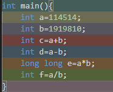
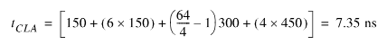
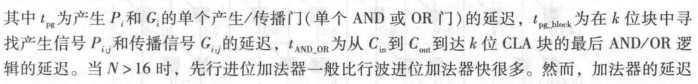
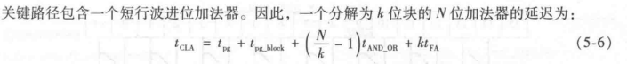

# solution
- 第一题解答
  设两数为$x$, $y$，位数均为$w$，则$x·y$位数为$2w$.设$u$是低$w$位表示的无符号数，$v$表示高$w$位的补码数字.通过数学推导有$x·y=v2^w+u$.

  根据位数表示规则，我们设$p$是和$u$位数表示一致的补码数，则有$u=p+p_{w-1}2^w$.这里$p_{w-1}$是$p$的最高有效位.令$t=v+p_{w-1}$,则$x·y=p+t2^w$.

  $t=0$时，$x·y=p$,不会溢出.后续推导使用整数除法定义
- 第二题解答
  
  
- 第三题解答
  每个门电路的延迟是`150ps`，则一位全加器的延迟是`450ps`.根据电路特点，行波进位加法器为$64X450ps=28.8ns$.

  根据下列式子推导得
  

  

  
- 第四题解答

  